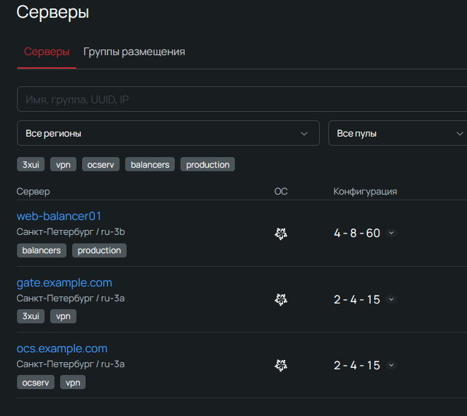

# Openstack inventory

## Принцип работы

1. Считывает конфиг плагина - openstack.yaml
2. Если в конфиге 1. есть параметр clouds, то берет конфиг подключения к облаку оттуда
3. Пытается считать стандартные конфигурационные файлы openstack:
   - ~/.config/openstack/clouds.yaml
   - ~/.config/openstack/clouds.yml
   - ~/.config/openstack/clouds.json
   - /etc/openstack/clouds.yaml
   - /etc/openstack/clouds.yml
   - /etc/openstack/clouds.json
   - ./clouds.yaml
   - ./clouds.yml
   - ./clouds.json
   - /etc/xdg/openstack/clouds.yaml
   - /etc/xdg/openstack/clouds.yml
   - /etc/xdg/openstack/clouds.json
4. Если в конфигурции плагина указан clouds_yaml_path, то пытается дополнительно считать перечень файлов из указанного пути
5. При установлении соединения с openstack инфраструктурой, плагин также считывает переменные окружения и использует их тоже:
   - OS_AUTH_URL
   - OS_USERNAME
   - OS_PASSWORD
   - OS_USER_DOMAIN_NAME
   - OS_REGION_NAME
   - OS_TENANT_ID
6. Формирует инвентарь для ansible

## Рекомендации по конфигурированию

1. Использовать кэширование в настройках плагина openstack.yaml:
   ```
   - cache: true
   - cache_plugin: jsonfile
   - cache_timeout: 3600
   - cache_connection: /tmp/ansible_cache/openstack
   ```
2. Использовать в качестве inventory_hostname имя виртуального инстанса:
   ```
   - inventory_hostname: "name"
   ```
3. Использовать keyed_groups для формирования групп:
   ```
   - keyed_groups:
     - prefix: "tag"
       key: openstack.tags
     - prefix: "zone"
       key: openstack.availability_zone
     - prefix: "region"
       key: openstack.cloud.region
   ```
5. Избегагть дублирование конфигурации плагина в разных местах (разные файлы и/или переменные окружения)

## Примеры конфигурации и запуска

### Исходное состояние виртуальных инстансов в облаке.

#### Список проектов в облаке:


#### Виртуальные инстансы и их теги в 1 проекте:


#### Виртуальные инстансы и их теги во втором проекте:


#### Виртуальные инстансы и их теги в третьем проекте:


### Конфигурация .clouds.yaml (общая для всех примеров)


#### настройки подключения к облаку: ANSIBLE_REPO_ROOT/.clouds.yaml

```
clouds:
  CLOUD_1_NAME:
    auth:
      auth_url: https://cloud.api.selcloud.ru/identity/v3
      username: "SERVICE_ACCOUNT_USERNAME"
      password: "SERVICE_ACCOUNT_PASSWORD"
      project_domain_name: "ACCOUNT_ID"
      user_domain_name: "ACCOUNT_ID"
    project_name: "PROJECT_1_NAME"
    regions:
      - "ru-1"
      - "ru-2"
      - "ru-3"
      - "ru-7"  
      - "ru-8"
      - "ru-9"
    interface: "public"
    identity_api_version: 3
  CLOUD_2_NAME:
    auth:
      auth_url: https://cloud.api.selcloud.ru/identity/v3
      username: "SERVICE_ACCOUNT_USERNAME"
      password: "SERVICE_ACCOUNT_PASSWORD"
      project_domain_name: "ACCOUNT_ID"
      user_domain_name: "ACCOUNT_ID"
    project_name: "PROJECT_2_NAME"
    regions:
      - "ru-1"
      - "ru-2"
      - "ru-3"
      - "ru-7"
      - "ru-8"
      - "ru-9"
    interface: "public"
    identity_api_version: 3
  CLOUD_3_NAME:
    auth:
      auth_url: https://cloud.api.selcloud.ru/identity/v3
      username: "SERVICE_ACCOUNT_USERNAME"
      password: "SERVICE_ACCOUNT_PASSWORD"
      project_domain_name: "ACCOUNT_ID"
      user_domain_name: "ACCOUNT_ID"
    project_name: "PROJECT_3_NAME"
    regions:
      - "ru-1"
      - "ru-2"
      - "ru-3"
      - "ru-7"
      - "ru-8"
      - "ru-9"
    interface: "public"
    identity_api_version: 3
```
Комментарии:
- **CLOUD_*_NAME** - уникальный идентификатор облака в конфигурации clouds.yaml. Имя произвольное, ни на что не влияет.
- **SERVICE_ACCOUNT_USERNAME** - имя сервисного аккаунта. Причем оно может быть разным для разных облаков. Главное чтобы используемый сервисный аккаунт имел доступ ко всем проектам, указанным в облаке.
- **SERVICE_ACCOUNT_PASSWORD** - пароль сервисного аккаунта
- **ACCOUNT_ID** - ID аккаунта. Шестизначный код, который присваивается каждому клиенту при регистрации в Selectel. Его видно в личном кабинете в правом верхнем углу.
- **PROJECT_*_NAME** - имя проекта в облаке. Оно **ДОЛЖНО СОВПАДАТЬ** с именем проекта в личном кабинете.

### Пример 1. Настройки по-умолчанию.
#### настройки плагина: ANSIBLE_REPO_ROOT/inventory/YOUR_PATH/openstack.yaml
```
plugin: openstack.cloud.openstack
clouds_yaml_path: .clouds.yaml
```

#### Пример 1. запуск инвентори:
```
cd ANSIBLE_REPO_ROOT
ansible-inventory -i inventory/YOUR_PATH/openstack.yaml --graph
```

#### Пример 1. результат:

```
@all:
  |--@CLOUD_1_NAME:
  |  |--gate.example.com
  |  |--ocs.example.com
  |  |--web-balancer01
  |--@CLOUD_1_NAME_ru-3:
  |  |--gate.example.com
  |  |--ocs.example.com
  |  |--web-balancer01
  |--@CLOUD_1_NAME_ru-3_ru-3a:
  |  |--gate.example.com
  |  |--ocs.example.com
  |--@CLOUD_1_NAME_ru-3_ru-3b:
  |  |--web-balancer01
  |--@CLOUD_2_NAME:
  |  |--nextcloud-server
  |--@CLOUD_2_NAME_ru-9:
  |  |--nextcloud-server
  |--@CLOUD_2_NAME_ru-9_ru-9a:
  |  |--nextcloud-server
  |--@CLOUD_3_NAME:
  |  |--proxy-host
  |--@CLOUD_3_NAME_ru-3:
  |  |--proxy-host
  |--@CLOUD_3_NAME_ru-3_ru-3a:
  |  |--proxy-host
  |--@flavor-1731479405197-6053433041-2-4096:
  |  |--ocs.example.com
  |--@flavor-1733821566381-5831707596-2-4096:
  |  |--gate.example.com
  |--@flavor-CPU1.4-8192:
  |  |--web-balancer01
  |--@flavor-SL1.1-1024:
  |  |--proxy-host
  |--@flavor-SL1.2-4096:
  |  |--nextcloud-server
  |--@image-None:
  |  |--gate.example.com
  |  |--nextcloud-server
  |  |--ocs.example.com
  |  |--proxy-host
  |  |--web-balancer01
  |--@instance-06c95a96-1ead-4e27-8d6c-3e8300a42305:
  |  |--ocs.example.com
  |--@instance-08f33dcd-3f14-4312-a3e0-93ba3da43c00:
  |  |--web-balancer01
  |--@instance-816af337-ac26-4abe-8280-841a7980e653:
  |  |--gate.example.com
  |--@instance-a1265569-c030-4f4a-ac7d-b6a8226b6479:
  |  |--proxy-host
  |--@instance-c4010dc6-469a-4142-ab41-f10fa340ec86:
  |  |--nextcloud-server
  |--@meta-x_sel_server_default_addr_{"ipv4":"192.168.0.2"}:
  |  |--gate.example.com
  |  |--proxy-host
  |--@meta-x_sel_server_default_addr_{"ipv4":"192.168.0.3"}:
  |  |--web-balancer01
  |--@meta-x_sel_server_default_addr_{"ipv4":"192.168.0.43"}:
  |  |--ocs.example.com
  |--@meta-x_sel_server_default_addr_{"ipv4":"192.168.0.52"}:
  |  |--nextcloud-server
  |--@meta-x_sel_server_network_autoconfig_false:
  |  |--gate.example.com
  |  |--nextcloud-server
  |  |--ocs.example.com
  |  |--proxy-host
  |  |--web-balancer01
  |--@meta-x_sel_server_password_hash_$6$BckbOTEt$lPQAeXzytGhwGB8IhtjAlD.jTryF3zheDnINVUOrzHo0oIugelMoKKrzsRGYTjB/A/Zkh16CcYpzAqV1PP0Ju0:
  |  |--ocs.example.com
  |--@meta-x_sel_server_password_hash_$6$NhkaTKUb$LKcyJPVgQRSE6WZPmzUhh8O/L0YhZknDkQuqt6L2fI2xpyxrdhZxEFVZf6cUomLqwfBOUdE01/v5NVfy/LhHc/:
  |  |--gate.example.com
  |--@meta-x_sel_server_password_hash_$6$dS0smVYx$j4rzIaL/SmQboKMIoqQfkxJoc4Fun4iOkI0.kpfvafjpebxV8MZpszNQ685A8Pj8hABGlJ8Q6uC0CTav9qDmi.:
  |  |--nextcloud-server
  |--@meta-x_sel_server_password_hash_$6$s0FKaJix$yE8SlcybsFJq4ELI.4r6TNm4VS3/6uhMVgzxc9EecAkSoT82SLHv1INe3CxLfYVfNWmD/t1674JN9GY9W3gFx0:
  |  |--web-balancer01
  |--@meta-x_sel_server_password_hash_$6$stIkcbWS$qKIKDzLbgH8eP2klGkdObRCmLagW6URVs0B6NX/xX/DSW1Hn2XKdzoBMt1xCTwy8wAs4ewyBAOLhVv6SsY0R61:
  |  |--proxy-host
  |--@ru-3:
  |  |--gate.example.com
  |  |--ocs.example.com
  |  |--proxy-host
  |  |--web-balancer01
  |--@ru-3_ru-3a:
  |  |--gate.example.com
  |  |--ocs.example.com
  |  |--proxy-host
  |--@ru-3_ru-3b:
  |  |--web-balancer01
  |--@ru-3a:
  |  |--gate.example.com
  |  |--ocs.example.com
  |  |--proxy-host
  |--@ru-3b:
  |  |--web-balancer01
  |--@ru-9:
  |  |--nextcloud-server
  |--@ru-9_ru-9a:
  |  |--nextcloud-server
  |--@ru-9a:
  |  |--nextcloud-server
  |--@ungrouped:
```

### Пример 2. Создаем в инвентори дополнительные группы через keyed_groups
#### настройки плагина: ANSIBLE_REPO_ROOT/inventory/YOUR_PATH/openstack.yaml
```
plugin: openstack.cloud.openstack
clouds_yaml_path: .clouds.yaml
keyed_groups:
  - prefix: "tag"
    key: openstack.tags
  - prefix: "zone"
    key: openstack.availability_zone
  - prefix: "region"
    key: openstack.cloud.region
```

#### Пример 2. запуск инвентори:
```
cd ANSIBLE_REPO_ROOT
ansible-inventory -i inventory/YOUR_PATH/openstack.yaml --graph
```

#### Пример 2. результат:

```
@all:
... (те же группы, что и в примере 1) +
  |--@host_gate_example_com:
  |  |--gate.example.com
  |--@host_nextcloud_server:
  |  |--nextcloud-server
  |--@host_ocs_example_com:
  |  |--ocs.example.com
  |--@host_proxy_host:
  |  |--proxy-host
  |--@host_web_balancer01:
  |  |--web-balancer01
  |--@tag_3xui:
  |  |--gate.example.com
  |--@tag_balancers:
  |  |--web-balancer01
  |--@tag_finance:
  |  |--nextcloud-server
  |--@tag_nextcloud:
  |  |--nextcloud-server
  |--@tag_ocserv:
  |  |--ocs.example.com
  |--@tag_production:
  |  |--web-balancer01
  |--@tag_vpn:
  |  |--gate.example.com
  |  |--ocs.example.com
  |--@ungrouped:
```
За счет дополнительного параметра (словаря) keyed_groups, в инвентори добавляются новые группы.
Данный функционал позволяет создавать группы по тегам, именам виртуальных инстансов, а также чему угодно остальному.

## Траблшутинг проблемы

### 1. Проблема: вместо имен хостов в инвентори попадают ID хостов

#### Пример: все или часть хостов в инвентори имеют ID вместо имени
```
@all:
  |--@CLOUD_1_NAME:
  |  |--gate.example.com
  |  |--ocs.example.com
  |  |--web-balancer01
  |--@CLOUD_1_NAME_ru-3:
  |  |--gate.example.com
  |  |--ocs.example.com
  |  |--web-balancer01
  |--@CLOUD_3_NAME:
  |  |--c4010dc6-469a-4142-ab41-f10fa340ec86
  |--@CLOUD_3_NAME_ru-9:
  |  |--c4010dc6-469a-4142-ab41-f10fa340ec86
  |--@CLOUD_3_NAME_ru-9_ru-9a:
  |  |--c4010dc6-469a-4142-ab41-f10fa340ec86
  |--@flavor-1731479405197-6053433041-2-4096:
  |  |--ocs.example.com
  |--@flavor-1733821566381-5831707596-2-4096:
  |  |--gate.example.com
  |--@flavor-CPU1.4-8192:
  |  |--web-balancer01
  |--@flavor-SL1.2-4096:
  |  |--c4010dc6-469a-4142-ab41-f10fa340ec86
  |--@host_gate_example_com:
  |  |--gate.example.com
  |--@host_nextcloud_server:
  |  |--c4010dc6-469a-4142-ab41-f10fa340ec86
```
#### Причина: дублирование конфигурации плагина в разных местах (разные файлы и/или переменные окружения)
Если имеется более 1 конфигурации плагина, то плагин будет использовать **ВСЕ** конфигурации, которые он нашел по очереди.

#### Решение:
1. Удалить все лишние конфигурации плагина (проверьте все пути перечисленные в начале статьи)
2. Удалить все лишние переменные окружения (если у вас основная конфигурация описана в файле). Если плагин получил данные из облака с помощью переменных окружения, то он полученные хосты помещает в группу с именем облака "envvars", это один из быстрых способов понять, когда в конфигурации используются переменные окружения.
3. Пользоваться дебагом:
   ```ansible-inventory -i inventory/YOUR_PATH/openstack.yaml --graph -vvvv```

### 2. Проблема: в инвентори попадают не все хосты

#### Решение:
1. Убедитесь, что в конфигурации плагина указаны все проекты.
2. Убедитесь, что в конфигурации плагина указаны все регионы.
3. Убедитесь, что в конфигурации плагина указаны корректные имя пользователя и пароль.
4. Убедитесь, что у пользователя имеются на доступ к указаннм проектам.


